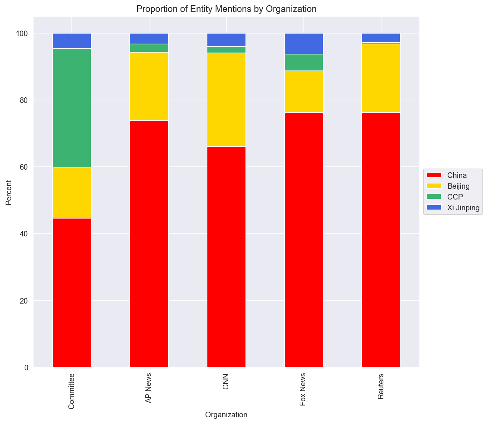

Run `main.py` to pull sources from the web (other than AP News data, which is retrieved from an included RSS feed) and
generate a plot demonstrating the differences in entity reference between organizations.

Alternatively, use the notebook `entity_usage.ipynb` to tinker with the data.

All data used in the plot included is archived under `organization_data`.